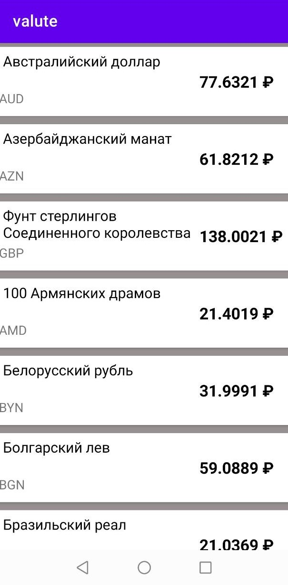

# Приложение "Курс валют"
Приложение для отображения списка валют, данные взяты с сайта ЦБ.

Данные извлекаются с помощью библиотеки **JSOUP** и представляются в формате **Json**.

Парсинг реализован с помощью **GSON** библиотеки, котороая позволяет текст преобразовать в объекты. Классы созданы с помощью плагина **JsonToKotlinClass**.

Вывод данных на интерфейс реализовани через адаптер **RecyclerView**

Пример работы приложения представлен ниже

