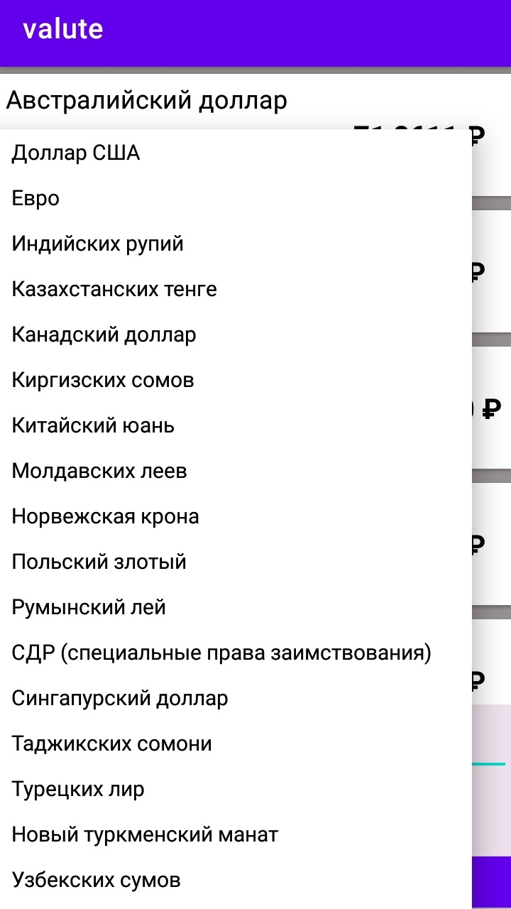
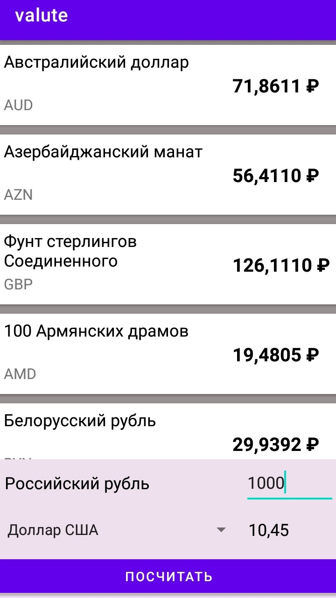

# Приложение "Курс валют"

Данные извлекаются с сайта ЦБ при помощи библиотеки **JSOUP** и представляются в формате **Json**.

Парсинг реализован с помощью **GSON** библиотеки, которая позволяет преобразовать текст в объекты. Классы созданы с помощью плагина **JsonToKotlinClass**.

Вывод данных на интерфейс реализован через адаптер **RecyclerView**.

Пример работы приложения представлен ниже.

P.S. Приложение, сделанное в установленный 8-ми дневный срок, размещен в ветке **main**. В дальнейшем оно было обновлено: улучшен код, добавлена функция конвертера(valute_app.v.2). Если это не противоречит условиям отбора - прошу рассматривать его. Пример работы обновленного приложения размещен в ветке [v.2.0](https://github.com/MaximNasonov/valute_app/tree/v.2.0).

  
   

